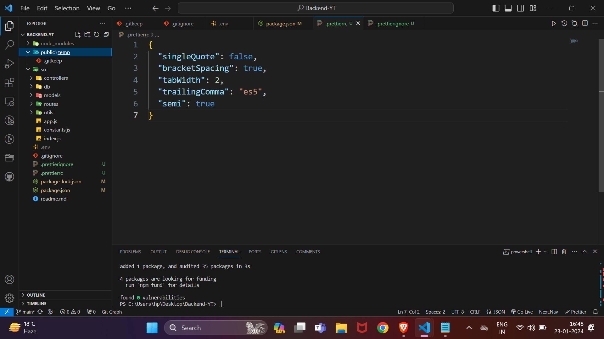

# Setup of Professional Backend Project

## 1.Project Structure:
Establish a clear project structure to keep your code organized. For example:



## 2.Uploads and Third-Party Services:
Design a file upload system where files are initially stored on your server` (/public/temp)` and then asynchronously moved to third-party services in case of a successful upload. This can be achieved using a task queue or background jobs.

## 3. .gitkeep Fil:
Create an empty .gitkeep file in empty directories (like `/public/temp`) to ensure Git tracks these directories, even if they are initially empty.

## 4. .gitignore File:
```bash
node_modules/
.env
.DS_Store
/public/temp/
/dist/
```

## 5. .env File:
Store environment variables in the `.env` file. These may include database connection details, API keys, etc.

## 6. Dependencies vs DevDependencies:
1. **dependencies**: These are required for the production runtime of your application.
2. **devDependencies**: These are only needed for development and testing.

```json
"dependencies": {
  "express": "^5.0.0",
  "mongoose": "^6.0.0",
  // ...other production dependencies
},
"devDependencies": {
  "nodemon": "^2.0.0",
  "prettier": "^x.x.x",
  // ...other development dependencies
}
```

## 7.Nodemon:
Use `nodemon` during development to automatically restart the server when changes are detected. Install it as a devDependency:

```css
npm install --save-dev nodemon
```
```json
"scripts": {
  "start": "node your-server-file.js",
  "dev": "nodemon your-server-file.js"
}
```
## 8.Environment Variables and Module Type Conflicts:
- Use a tool like dotenv to load environment variables from your `.env` file.
- Avoid conflicts by ensuring modules consistently handle environment variables. Use conditional checks or default values where necessary.

## 9. Prettier:
- Install `prettier` as a devDependency:
```css
npm install --save-dev prettier
```
- Create a .prettierrc file with your preferred Prettier configurations.

- Add a script in your package.json to format your code:
```json
"scripts": {
  "format": "prettier --write 'src/**/*.js'"
}
```
- Run `npm run format` to format your code.


## 1. Project Structure:
Establish a clear project structure to keep your code organized. For example:

## 1. Project Structure:
Establish a clear project structure to keep your code organized. For example:

## 1. Project Structure:
Establish a clear project structure to keep your code organized. For example:
